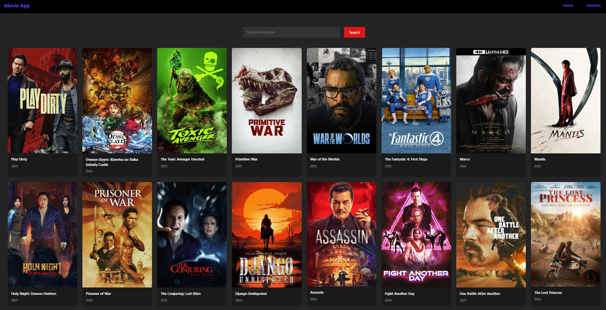
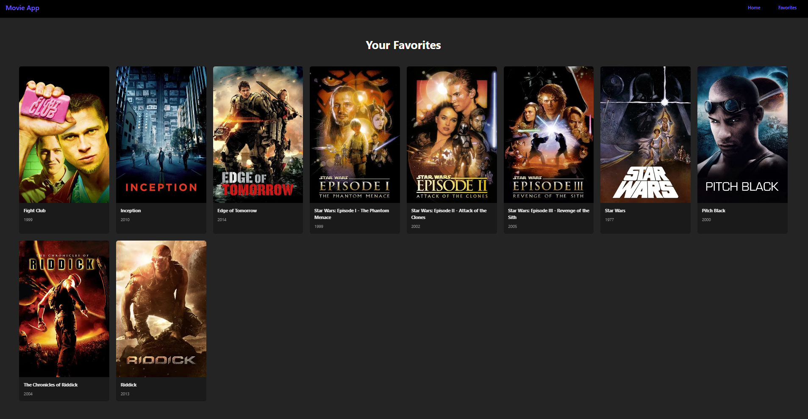

# Movie Explorer App

A React + Vite web app to browse and favorite movies using The Movie Database (TMDB) API.

---

## 🧭 Table of Contents

- [About](#about)  
- [Features](#features)  
- [Demo](#demo)  
- [Screenshots](#screenshots)  
- [Tech Stack](#tech-stack)  
- [Setup & Installation](#setup--installation)  
- [Environment Variables](#environment-variables)  
- [Usage](#usage)  
- [Project Structure](#project-structure)  
- [Future Improvements](#future-improvements)  
- [License](#license)  

---

## 📖 About

Movie Explorer is a simple web application built with React and Vite. It lets users search for movies, view today's popular movies, and add/remove movies to their favorites list. Movie data is fetched from **TMDB (The Movie Database)**.

---

## ✅ Features

- Display popular movies  
- Search movies by title  
- See movie details (poster, title, release date, overview)  
- Add and remove favorites  
- Responsive dark-themed UI  
- Smooth transitions & animations  
- Persistent favorites (e.g. local state or context)  

---

## 🖼 Screenshots

Below are a few sample views from the app:

| Home Page | Favorites Page |
|------------|----------------|
|  |  |

---

## 🛠 Tech Stack

- **React** - For building UI  
- **Vite** - Build tool & development server  
- **CSS / Flexbox / Grid** - For styling & layout  
- **TMDB API** - For movie data  
- **React Context** - For state (favorites)  

---

## 🚀 Setup & Installation

1. Clone the repository:
   ```bash
   git clone https://github.com/YourUsername/Movie-Explorer-App.git
   cd Movie-Explorer-App
   ```

2. Install dependencies:
   ```bash
   npm install
   ```

3. Create an environment file:
   ```text
   VITE_TMDB_API_KEY=your_tmdb_api_key_here
   ```

4. Start the dev server:
   ```bash
   npm run dev
   ```

5. Open your browser at `http://localhost:5173` (or the URL shown in terminal).

---

## 🔑 Environment Variables

This project uses Vite’s built-in support for environment variables:

- `VITE_TMDB_API_KEY` - your TMDB API key  
  > ⚠️ **Do not commit your `.env` file to GitHub.**

---

## 🧩 Usage

- On load, you’ll see a list of popular movies.
- Use the **search bar** to find specific movies.
- Click on a movie’s **“Add to Favorites”** to save it.
- Go to the **Favorites** page to view all your favorites.
- To remove a movie, click **“Remove from Favorites”**.

---

## 📂 Project Structure

Here’s how your project is organized (example):

```
Movie-Explorer-App/
├── public/
├── src/
│   ├── components/
│   │   ├── MovieCard.jsx
│   │   └── …  
│   ├── contexts/
│   │   └── MovieContext.jsx
│   ├── pages/
│   │   ├── Favorites.jsx
│   │   └── Home.jsx
│   ├── css/
│   │   ├── Favorites.css
│   │   ├── MovieCard.css
│   │   └── …  
│   ├── api.js
│   ├── App.jsx
│   └── main.jsx
├── screenshots/
│   ├── home.png
│   └── favorites.png
├── .env
├── .gitignore
├── package.json
└── vite.config.js
```

---

## 🌱 Future Improvements

- Store favorites in **localStorage** so they persist across browser reloads  
- Add **movie detail pages** (more info, trailers, cast)  
- Pagination / infinite scrolling for large lists  
- Add user authentication and personal profiles  

---

## 📄 License

This project is open-sourced under the **MIT License**.  
Feel free to use, modify, and distribute it for personal or commercial projects.

---
